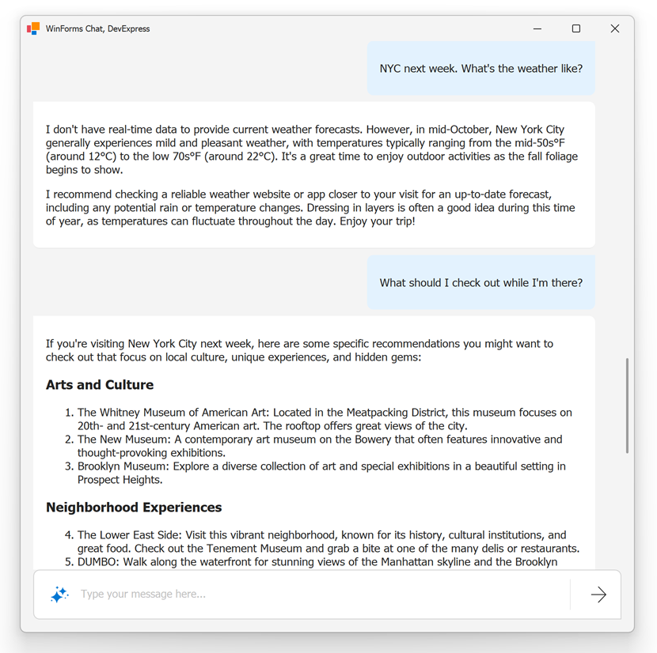

<!-- default badges list -->

[](https://supportcenter.devexpress.com/ticket/details/T1301351)
[](https://docs.devexpress.com/GeneralInformation/403183)
[](#does-this-example-address-your-development-requirementsobjectives)
<!-- default badges end -->

# WinForms Chat for .NET Framework

This example extends the DevExpress WinForms Chat Client App demo. It creates a Copilot-inspired, AI-powered chat interface without using `BlazorWebView`. The example uses 'native' DevExpress UI controls (such as our WinForms `GridControl`, `MemoEdit`, and `HtmlContentControl`). The app targets .NET Framework 4.6.2 or later and integrates with the Azure OpenAI service to support conversational engagement, Markdown rendering, and structured message display within a fully native WinForms environment.



> [!TIP]
> You can migrate this example to .NET 8 or later. Review the following help topic for instructions: [Migrate DevExpress-powered .NET Framework Apps to the Latest .NET Version](https://docs.devexpress.com/WindowsForms/405091/net-net-core-support/migrate-net-framework-app-to-net).

## Controls and Technologies Used

* **DevExpress WinForms Controls**
    * `GridControl` - Displays the conversation history
    * `HtmlContentControl` - Renders styled messages
    * `MemoEdit` - Captures user input
* **[DevExpress AI-powered Extensions](https://www.devexpress.com/winforms/ai-powered-extensions)**
* **HTML & CSS Styling**: [DevExpress HTML & CSS Support](https://www.devexpress.com/winforms/html-css)

## Prerequisites

* Visual Studio 2022 or later
* .NET Framework 4.6.2 or later

## Solution Structure

* **DevExpress.AI.WinForms.HtmlChat** Project - Implements the UI and associated logic
* **DevExpress.AI.WinForms.HtmlChat.Demo** Project - Hosts the chat control and registers the AI client.

## Implementation Details

### Register AI Client

Register the AI Chat client at application startup:

```cs{2-7}
static void Main() {
    AzureOpenAIClient azureOpenAIClient = new AzureOpenAIClient(AzureOpenAIEndpoint, AzureOpenAIKey, new AzureOpenAIClientOptions() {
        Transport = new PromoteHttpStatusErrorsPipelineTransport()
    });
    IChatClient chatClient = azureOpenAIClient.GetChatClient("gpt-4o-mini").AsIChatClient();
    var container = AIExtensionsContainerDesktop.Default;
    container.RegisterChatClient(chatClient);

    Application.EnableVisualStyles();
    Application.SetCompatibleTextRenderingDefault(false);
    Application.Run(new MainForm());
}
```

### Handle User Input and LLM Response

Capture user input, update the message list, and retrieve a response from the LLM:

```cs
// A collection of chat messages bound to a GridControl.
BindingList<ChatMessage> messages = new BindingList<ChatMessage>();

async void TypingBox_ElementMouseClick(object sender, Utils.Html.DxHtmlElementMouseEventArgs e)
{
    if (e.ElementId == "btnSend")
    {
        string message = messageEdit.Text;
        messageEdit.BeginInvoke(new Action(() => messageEdit.Text = string.Empty));
        await SendMessage(message);

    }
    if (e.ElementId == "btnRemove")
    {
        ClearMessages();
    }
}

// Send a message and append a reply.
public async Task SendMessage(string userContent)
{
    if (string.IsNullOrEmpty(userContent))
        return;
    IChatClient service = AIExtensionsContainerDesktop.Default.GetService<IChatClient>();
    messages.Add(new ChatMessage(ChatRole.User, userContent));
    messagesItemsView.MoveLast();

    // Display an overlay form while waiting for the response.
    AIOverlayForm form = new AIOverlayForm();
    var cancellationTokenSource = new CancellationTokenSource();
    form.ShowLoading(this, cancellationTokenSource);
    
    try
    {
        ChatResponse chatResponse = await service.GetResponseAsync(messages, cancellationToken: cancellationTokenSource.Token);
        messages.AddMessages(chatResponse);
        messagesItemsView.MoveLast();
        form.Close();
        form.Dispose();
    }
    catch (Exception e)
    {
        form.ShowError(this, e.Message, true);
    }
}
```

### Render Markdown in AI Responses

The example uses the [Markdig Markdown](https://www.nuget.org/packages/Markdig/) processing library to convert Markdown text into HTML:

```cs{13,14}
void OnQueryItemTemplate(object sender, QueryItemTemplateEventArgs e) {
    var message = e.Row as ChatMessage;
    if(message == null)
        return;

    // Apply a template based on the chat role (User or Assistant).
    if(message.Role == ChatRole.User)
        Styles.MyMessage.Apply(e.Template);
    else
        Styles.Message.Apply(e.Template);

    // Convert Markdown to HTML.
    string htmlString = Markdig.Markdown.ToHtml(message.Text);
    e.Template.Template = e.Template.Template.Replace("${Text}", htmlString);
}
```

<!-- default file list -->
## Files to Review

* [MainForm.cs](./CS/DevExpress.AI.WinForms.HtmlChat.Demo/MainForm.cs)
* [ChatControl.cs](./CS/DevExpress.AI.WinForms.HtmlChat/ChatControl.cs)
* [Program.cs](./CS/DevExpress.AI.WinForms.HtmlChat.Demo/Program.cs)
<!-- default file list end -->

## Documentation

  * [DevExpress AI-powered Extensions for WinForms](https://docs.devexpress.com/WindowsForms/405151/ai-powered-extensions)
  * [WinForms AI Chat Control for .NET](https://docs.devexpress.com/WindowsForms/405218/ai-powered-extensions/ai-chat-control)
  * [HTML and CSS Support](https://docs.devexpress.com/WindowsForms/403397/common-features/html-css-based-desktop-ui)
 
## Related Examples

* [Blazor AI Chat - Add the DevExpress Blazor AI Chat component to your next Blazor, MAUI, WPF, and WinForms app](https://github.com/DevExpress-Examples/devexpress-ai-chat-samples)

<!-- feedback -->
## Does this example address your development requirements/objectives?

[](https://www.devexpress.com/support/examples/survey.xml?utm_source=github&utm_campaign=winforms-chat-for-net-framework&~~~was_helpful=yes) [](https://www.devexpress.com/support/examples/survey.xml?utm_source=github&utm_campaign=winforms-chat-for-net-framework&~~~was_helpful=no)

(you will be redirected to DevExpress.com to submit your response)
<!-- feedback end -->
